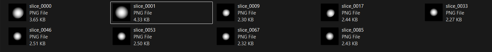

# artery-blockage-detection
Machine learning model using TensorFlow to predict arterial blockage from synthetic artery cross-section data
# 🧠 Artery Blockage Detection using TensorFlow

A machine learning model designed to predict arterial blockage based on cross-sectional artery data using a synthetically generated dataset.

---

## 🚀 Overview

This project explores the application of machine learning in detecting arterial blockage patterns from structural data.

Due to ethical and privacy constraints in accessing real medical datasets, a **synthetic dataset** was generated to simulate varying levels of arterial narrowing. The model was trained to recognize patterns in these simulated cross-sections.

---

## 🛠️ Tech Stack

- Python  
- TensorFlow  
- NumPy  
- Pandas  
- Jupyter Notebook  

---

## 📊 Dataset

- Synthetic dataset representing artery cross-sections  
- Includes multiple levels of blockage (normal → severe)  
- Designed to simulate structural variations in arteries  

---

## 🧠 Model

- Neural network built using TensorFlow  
- Trained on synthetic data for pattern recognition  
- Focused on identifying blockage levels from input features  

---

## 📈 Results

- Achieved ~97% accuracy on the synthetic dataset  
- Evaluated on generated test samples across different blockage levels  
- Performance reflects effectiveness on controlled, simulated data  

---

## ⚙️ How It Works

1. Generate synthetic artery cross-section data  
2. Preprocess data for training  
3. Train neural network using TensorFlow  
4. Evaluate model performance on test data  

---

## 📸 Sample Visualization

Synthetic artery cross-section samples representing different levels of blockage

---

## ⚠️ Disclaimer

This project uses synthetic data and is intended for **educational and experimental purposes only**.  
It is not suitable for real-world medical diagnosis.

---

## 📌 Future Improvements

- Use real medical datasets (with proper ethical approval)  
- Implement CNN for image-based analysis  
- Improve validation and generalization  
- Enhance dataset realism  

---

## 👨‍💻 Author

**Madhav Bhanot**  
Computer Science Student | AI & Robotics  

GitHub: https://github.com/madhavbhanot6-alt
